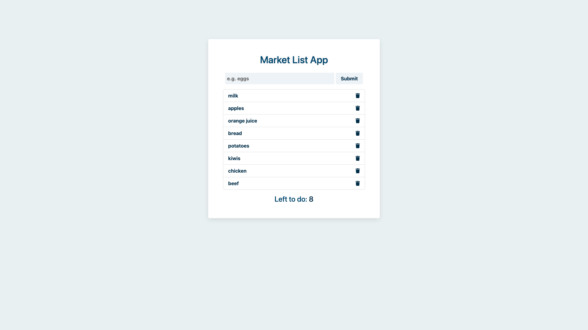

# Tea Time : <a target="_blank" href="https://tea-time-app.netlify.app/">Visit Here</a>

### Fully responsive app that displays tea-brewing-data from a custom built CRUD API using Fetch API

## Tech used: 

My focus was creating a seemless experience between the CRUD API and the client-side Javascript while utilizing simple yet elegant styles on the front end.

## Optimizations

My next steps for improving this project would be to create inputs to allow users to upload and store their own data. I would also create a blogging system with user authentication where anyone with an account can write and upload blogs targeted towards the tea-lovers community.

## Lessons Learned:

I learned about the different bugs to avoid when hosting applications with the API on server running in the same repository. I was able to fix most issues by keeping the API and the front-end code on separate files and using the Fetch API to retrieve data rather than serving data directly from the server.

## More Projects

<table bordercolor="#66b2b2">
  
  <tr>
    <td width="33.3%"  style="align:center;" valign="top">
<a target="_blank" href="https://github.com/Cesar-Quintero/Cesar-Quintero-Portfolio-Website">Portfolio Website</a>
         
      
    </td>
    <td width="33.3%" valign="top">
<a target="_blank" href="https://github.com/Cesar-Quintero/Coiffeur">Coiffeur</a>
       
        
    </td>
    <td width="33.3%" valign="top">
<a target="_blank" href="https://github.com/Cesar-Quintero/Market_List_App">Market List App</a>
         
      
    </td>
  </tr>
</table>